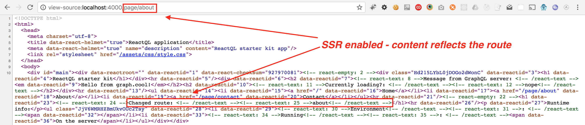

# Server-side routes

---
Routes work on both the server and in the browser. ReactQL will render the initial HTML to reflect the exact route that was requested, giving your visitors fast, relevant content without the typical 'flicker' that can often occur with single-page apps that rely solely on client-side routing.

If you run `npm run build-run` on a new ReactQL starter kit and navigate to [http://localhost:4000/page/about](http://localhost:4000/page/about), you can see an example of server-side rendering at work:

