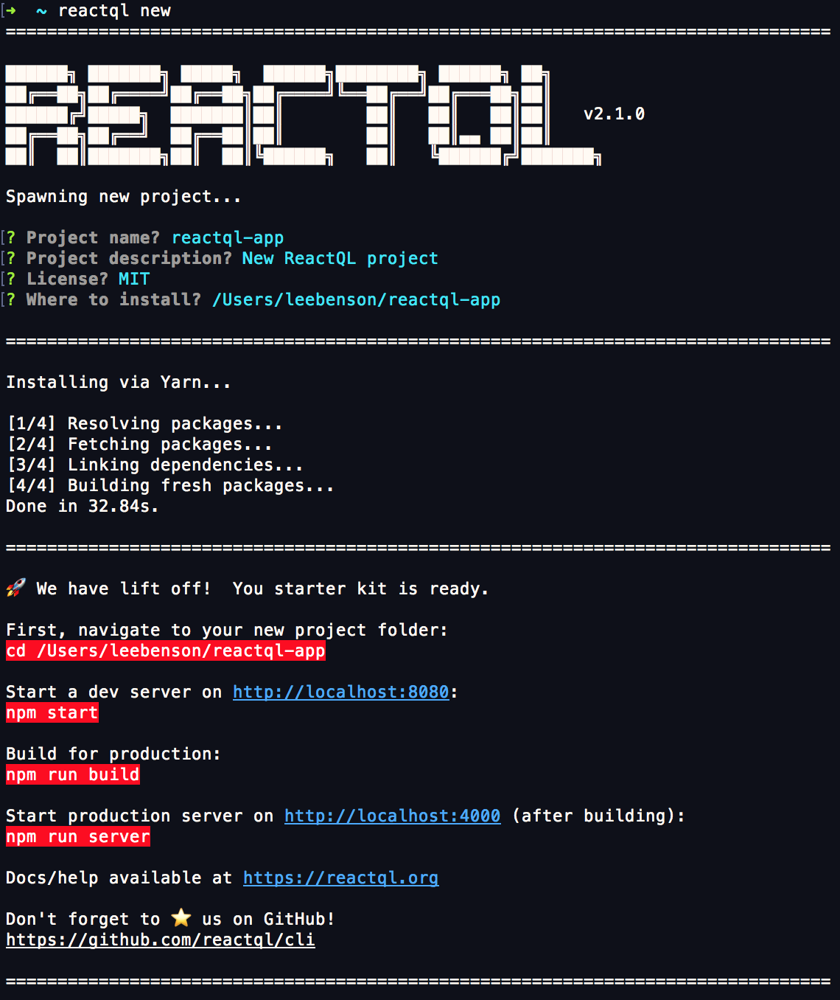

# Starting a new project

---
Once you've [installed ReactQL](installation.md), starting a new project is just one command:

```bash
reactql new
```

... to run through the interactive project wizard.

ReactQL will download the [starter kit source](https://github.com/reactql/kit) from Github, extract the archive to your chosen folder, install the required NPM modules, and set everything up. When finished, usage instructions will be dumped to your console.

You should then see a screen like this:


