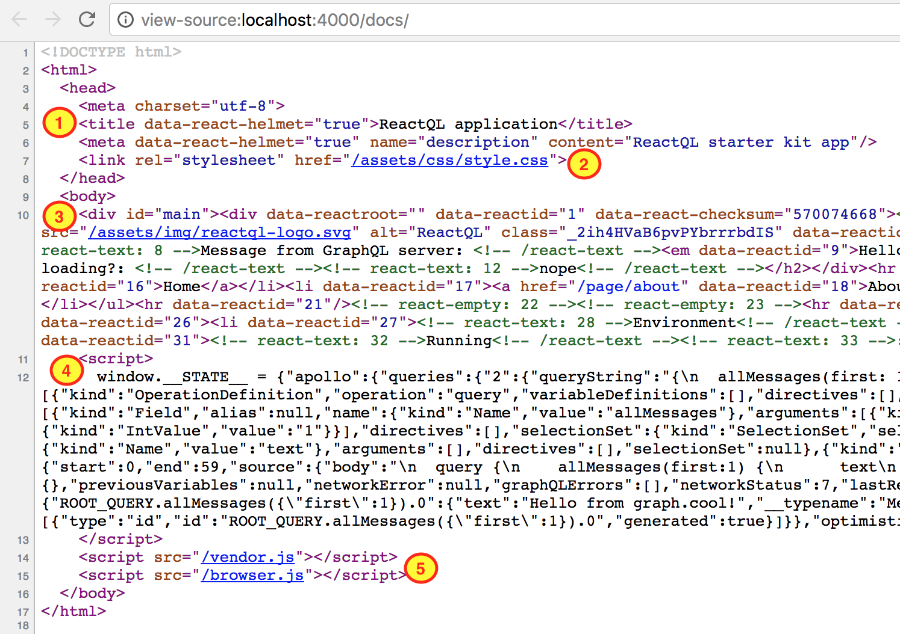

# How ReactQL implements SSR

---
## Features you get out-the-box

ReactQL includes a [Koa web server](http://koajs.com/). In [production mode](/running/production.md), the entry point Webpack will use to generate your web server code is [`kit/entry/server_prod.js`](https://github.com/reactql/kit/blob/master/kit/entry/server_prod.js). In development, it's [`kit/entry/server_dev.js`](https://github.com/reactql/kit/blob/master/kit/entry/server_dev.js)

In both modes, navigating to a server route returns a full HTML dump to the client.

An example response-- notes below:



This demonstrates the following features:

### 1. `<head>` re-winding

---
Thanks to [React Helmet](https://github.com/nfl/react-helmet), you can declare `<head>` content anywhere inside your React chain, and it'll wind up in the resulting HTML.

Use it like this:

```jsx
// React Helmet
import Helmet from 'react-helmet';

// Define <Helmet> (i.e. <head>) settings anywhere
const Component = (
  <div>
    <Helmet
      title="ReactQL application"
      meta={[{
        name: 'description',
        content: 'ReactQL starter kit app',
      }]} />
  </div>
);
```

Helmet makes it easy to add request-specific, dynamic titles and meta data.

### 2. Pre-compiled CSS stylesheets

---
Stylesheets used anywhere in your app are optimised, minified and concatenated into a single file in production, which winds up in `dist/public/assets/css/style.css`.

> Learn more about [ReactQL stylesheets here](/stylesheets/README.md)

Files ending in `.scss` or `.sass` as first processed by [node-sass](https://github.com/sass/node-sass). Files ending in `.css` skip the SASS compilation step. Both types are then processed by [PostCSS](http://postcss.org/), using [CSSNext](http://cssnext.io/) rules.

Stylesheet code is heavily optimised, common CSS rules are combined, and browser prefixes are added automatically.

Although it's generally a good idea to avoid loading styles that aren't relevant to the current route, the aggressive optimisation and automatic gzipping typically results in a very small `style.css` file. In the original starter kit, `style.css.gz` is just 317 bytes.

Given the small file sizes involved, it's generally okay to keep the css file as a blocking `<link>` in the resulting HTML. The effort of splitting stylesheets generally yields a low ROI, and can give way to a [flash of unstyled content](https://en.wikipedia.org/wiki/Flash_of_unstyled_content).

### 3. React to HTML

---
React components that are active in the current route are rendered to HTML, and sent back to the browser inside the `#main` div, like so:

```html
<body>
  <div id="main">
    <!-- React code will be converted to HTML and placed here -->
  </div>
</body>
```

ReactQL uses ReactDOMServer's [renderToString()](https://facebook.github.io/react/docs/react-dom-server.html#rendertostring) method, allowing the browser to load the resulting HTML into the local bundle and continue serving further React changes on the client-side.

> Before HTML is sent back to the browser, GraphQL queries are executed on the server asynchronously, and 'awaited'. See [React components with GraphQL data](/writing_code/graphql.md) for a how-to on writing components that require GraphQL data.

### 4. Store dehydration (Redux)

---
If the server has already requested data from a third-party source like a GraphQL server, it makes little sense to repeat that same request on the client-side.

Instead, ReactQL automatically sends down the 'state' of the application along with the initial HTML render.

The browser can then use this data to 'rehydrate' the state of the application, and continue from the point the server finished - without surplus API calls or unnecessary round-trips to a third-party resource.

The built-in [Apollo Client (for React)](http://dev.apollodata.com/react/) uses [Redux](http://redux.js.org/) under the hood, for managing 'store' state and implementing its data loading and caching strategy.

To make it easier to manage your own application state, ReactQL includes custom instantiation code for managing Redux instead of relying on Apollo's implicit store state. This makes it trivial to add [custom reducers](http://redux.js.org/docs/basics/Reducers.html), and share store state from the server to the client.

> ReactQL includes built-in support for [Redux Devtools](/state/devtools.md) in the browser

### 5. Code bundling

---
Two client-side bundles are produced by the server config, and loaded by your browser:

1. `vendor.js`. Third-party code from NPM modules that are used in the starter kit, or imported into your own code.

2. `bundle.js`. Your own app code.

Vendor code is produced automatically from modules that appear in the `node_modules` folder. Any other code winds up in `bundle.js`.

> If you use code-splitting, Webpack will produce additional files such as `bundle.0.js`, `bundle.1.js`, etc. These are loaded asynchronously as needed - you don't need to explicitly define a loading mechanism, Webpack will do this for you.
