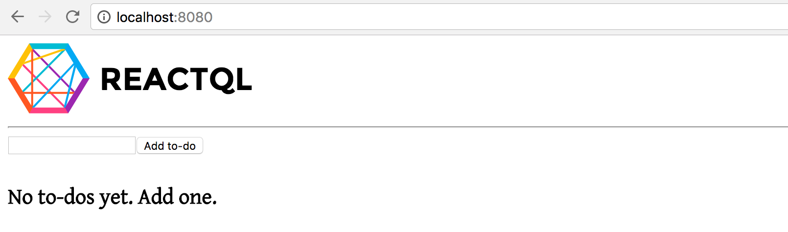
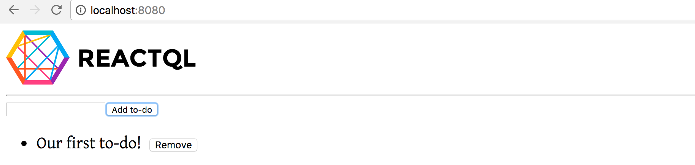

# Running the demo

---
After designing our screens, we might have something that looks like this:

If we add a to-do to the input box and click the button, we get:

Pretty cool!

But even cooler, is that we can do the same on the *server*....
