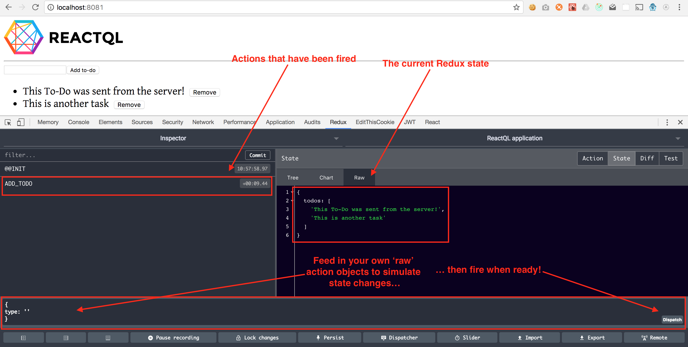

# Redux DevTools

---
In the Chrome webstore, there's an awesome free [Redux DevTools](https://chrome.google.com/webstore/detail/redux-devtools/lmhkpmbekcpmknklioeibfkpmmfibljd) extension that lets you view Redux state from within the Developer console.

Remember this line from [kit/lib/redux.js](https://github.com/reactql/kit/blob/master/kit/lib/redux.js)?

```js
(!SERVER && typeof window.__REDUX_DEVTOOLS_EXTENSION__ !== 'undefined') ? window.__REDUX_DEVTOOLS_EXTENSION__() : f => f,
```

This gives the Redux DevTools extension what it needs to attach itself to the Redux state, which then activates comprehensive tooling to debug most every aspect of Redux:



You can even dispatch your own action objects from within here, to simulate what happens when firing from within functions. Try this one an see what happens:

```js
{
  type: 'ADD_TODO',
  todo: 'Watch me magically appear on the screen!'
}
```

Enjoy!
