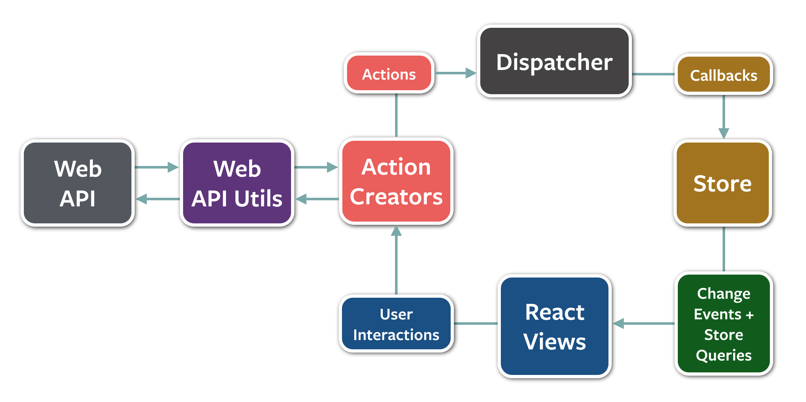

# How Redux works

---
[Redux](http://redux.js.org/)  is a library that adopts a [Flux-like](https://github.com/facebook/flux) pattern, that allows you to trigger 'actions' that affect the global state. Any component 'listening' to state automatically re-render in response to changes:

[Redux](http://redux.js.org/) adopts a similar pattern, but simplifies a lot of the boilerplate usually required to make this work.

Instead of many 'stores' of state, your application has just one single state object, which you can apply 'reducers' to that affect changes to state.
