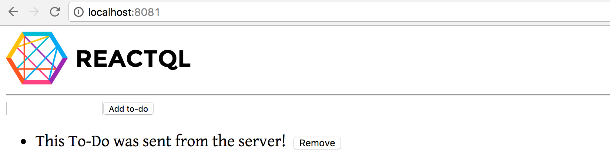
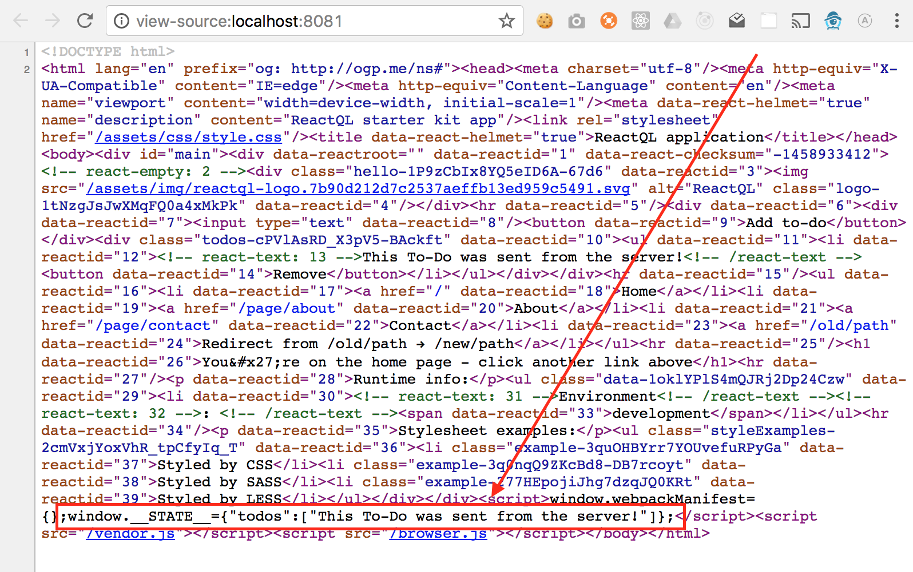

# Server-side state

---
Let's imagine that our initial to-dos are loaded from a database, and we want to populate the first render back to the screen with those to-dos intact.

If we do this only in the browser, we might initially see a 'flicker' where the `todos` state object is empty, and then the `<li>` items suddenly populate at some time in the future whenever the data has been loaded.

That's not a great experience for the user, who may wonder why the list that says 'no to-dos' suddenly changes on them.

Instead, let's inject the _initial_ state on the server, and let the client automatically rehydrate this state for use in the browser.

We already have all of the pieces in play to do that - ReactQL does that out-the-box. All we need to do is tell the server what our initial state is. Let's edit [kit/entry/server.js](https://github.com/reactql/kit/blob/master/kit/entry/server.js) to simulate adding our first to-do:

**kit/entry/server.js**
```js
// ...

// Import our 'AddToDo' action
import { addToDo } from 'store/actions';

// ...

// Inside the `reactHandler` function...
// Create a new Redux store for this request
const store = createNewStore();

// Add a to-do on the server side, to demonstrate how the state is
// sent back down the wire and dehydrated by the browser
store.dispatch(
  addToDo('This To-Do was sent from the server!'),
);

// ... continue with the rest of our server code
```

If we fire up our development web server, we now see this:



Awesome! Our browser has 'rehydrated' the state sent back down from the server, and continued where the server finishes.

If we check out the source code, we can see the 'to-do' data has been added to `window.__STATE__`:



That's how the browser knows what the initial state is. See [server-side rendering](/ssr/README.md) for more info on how this works
